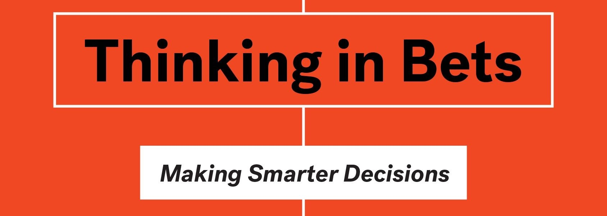

I've been spending a lot of time recently reading and thinking about decision making.  How can I get better at it?  What is even the definition of "it"?  (Hmm... maybe I should be in politics).  The result of this is a distillation of several sources into what I'm trying to build my process and system to be.

## TOC
*  [Quantifying Decisions](https://github.com/jotpowers/Personal-Growth/blob/master/decision-making.md#quantifying-decisions)
*  [Want To Bet?](https://github.com/jotpowers/Personal-Growth/blob/master/decision-making.md#want-to-bet)
*  [Decision Journal](https://github.com/jotpowers/Personal-Growth/blob/master/decision-making.md#decision-journal)
*  [Mental Models](https://github.com/jotpowers/Personal-Growth/blob/master/decision-making.md#mental-models)
*  [How People Make Decisions](https://github.com/jotpowers/Personal-Growth/blob/master/decision-making.md#how-people-make-decisions)

## Quantifying Decisions

My first noodling on the subject came from reading [Superforecasting](books.md#Superforecasting).  It's on my "must read" list for a reason.  But, the key here is to look at how people who are good at forecasting (which is just trying to estimate the outcomes that could impact your decision making) do it.  You should read the whole book, it's remarkably well written in a bog pit of business books, but if I were to summarize, here is what it would be:

1. Create a baseline probability based on analyzing historical results.  
2. Modify that baseline with any other data that you think would change the results either up or down.
3. When you get more data, adjust your probabilities.

This seems remarkably simple, but chances are you've never done this.  (I know I hadn't until recently).  From there the question is, do you...

## Want To Bet?

From here we move into a discussion of how we could use that data in decision making.  I started thunking on this after listening to Annie Duke's [podcast](podcasts.md#annieduke1)[(s)](podcasts.md#annieduke2).  From there I clearly had to read her book as well.  Here we really start thinking about decision making, and there are few points that are super important.

One of the important pieces out of this is to recognize that (almost) all decisions are made with imperfect information.   Given that, your ability to have 100% correct decisions and outcomes is impossible.  (It's why poker is a great teaching tool).

1. Do not confuse the quality of your decisions with the outcomes.
2. Do not "result".  Which is to look at the result of a process and assume that your decision making was the only contributing factor.
3. Finally, build a "decision board" of people who will hold you accountable to analyzing your decisions and outcomes.

This last one is the one I haven't figured out how to do yet, but I think it's important.  Especially because it allows you to find emotional satisfaction in having your decisions challenged.

If you don't do this last one, then your stupid monkey brain will automatically use emotion to rationalize decisions.

In order to start working on this within your group/org/company the phrase that comes out is "Want to bet?"  Suddenly, you're challenging people to come up with their version of forecasting.

This transitions into...

## Decision Journal

All of this is great, but unless you have a process to review, analyze and try to improve, it's all just touchy-feely new age, shakra, crystal, aura fun.  So, what you need is a "decision journal".  This came to me from [Shane Parrish's Farnam Street](https://fs.blog/2014/02/decision-journal/).  One of only two podcasts I've really latched onto and one of only a couple of emails I voluntarily receive and don't mark spam.

I'm still early in this journey.  My first process was to use a version of his template and my [Rocketbook](https://getrocketbook.com).  But I still struggled with how I was going to do longer term analytics.   I thought about an excel spreadsheet and ... but my current iterations is a [Google Form](https://docs.google.com/forms/d/1UzjtdeQo8oO-jCzDoAvJJ9pVJUqH7q7OXNAmP8Kk_pY/copy).  To use this form:

  1. Click on the link and make a copy
  2. Then go to Form and either "Edit form" or "Go to live form" and make it  your own.

So now, I have a way to do analytics and feedback on my decisions.

## Appendix

### Mental Models

Ok, I think Shane Parrish has gone overboard on this, but I also think (see above) that I could be wrong.  You can find a list of [109 Mental Models](https://fs.blog/mental-models/) (no, I'm not kidding) to consider.  I don't think all of these are useful, but different ones will likely be good for different people, so here you go.

### Other Reading
* [Howard Marks](https://en.wikipedia.org/wiki/Howard_Marks_(investor)) wrote one of his well known memos titled [You Bet!](https://www.oaktreecapital.com/insights/howard-marks-memos) that also covers a lot of this ground.

### How People Make Decisions

> **Note**:  Originallly I had this higher up but I think it interferes with the flow of the documentation, so I moved it down here.  Also, I haven't done enough research on the actual state of science on this part to advocate for it as truth.

Interestingly enough, how people make decisions isn't necessarily straight forward.  There are generally three ways that people make decisions, recognizing of course, that these aren't discrete, but ranges.  Which is to say, there is a continuium between them that the decision process can fall into.  What is vitally important to recognize is that most people will rationalize this decision process after the fact to make it fit their internal narrative.

1. Tribal
  This is the most basic of the decision making processes.  For a vast majority of our history, the best way to ensure your success and survival was to be a part of a tribe.  Thus, being included in that tribe was a goal, and we've optimized for it.  In this system, you are more likely to make decisions that you think align with your self identified tribe.  This process explains a large portion of the U.S. political landscape, and probably the landscapes of politics almost everywhere.  You see it used very effectively across cultures and times, but a leader simply finding a marginalized group to vilify in order to create a "tribe" that people will self-identify with.  It also bleeds into ...
2. Good vs Evil
  Here you make decisions based on what is morally correct or wrong.  This sounds much more palatable, but still is very subjective.  The obvious examples of this are based in religion.  Since religion is the basis for some views on values, if there is a decision that might be against the religious views, it can be an "evil" that influences decisions.
3. Rational
  Take the observable facts and outcomes, and determine the best way to maximize your chances of favorable outcomes that meet the objectives.  This last one is what I'm focusing on in this document.
