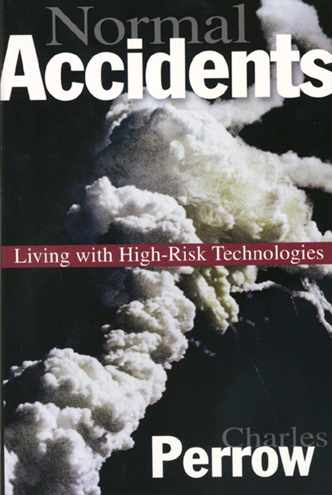
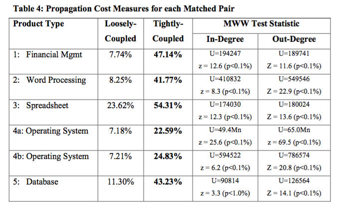
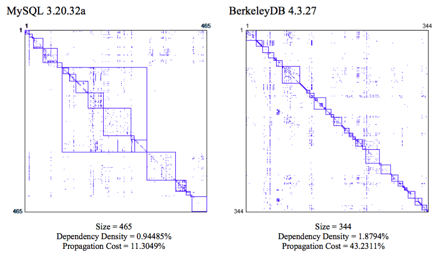
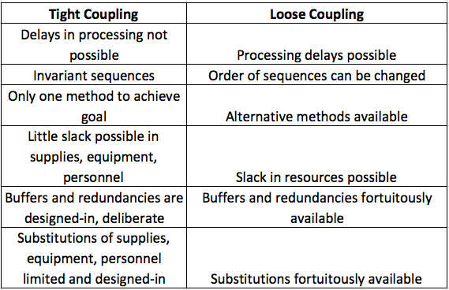
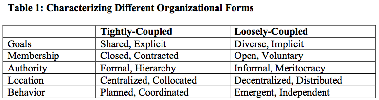
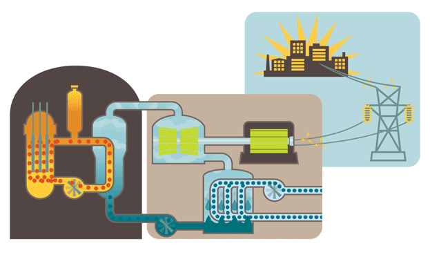

This is a rabbit hole I went down in 2016/17.  There are a lot of interesting books out there, and I tend to read a decent amount, and I don't remember where, but there was a recommendation for [Charles Perrow](https://en.wikipedia.org/wiki/Charles_Perrow)'s [Normal Accidents](https://en.wikipedia.org/wiki/Normal_Accidents).  I was hooked, because I saw the parallels in the complexity of large software systems with the complexity of other tightly coupled, complex systems.

## Overview

Where this has the most direct access for most people is in software.  So, although it is true that ["Software is eating the world"](https://a16z.com/2011/08/20/why-software-is-eating-the-world/), it naturally grows more complex, and sometimes there is going to be a bit of acid reflux.

### Success
If you want to ensure you have the most [antifragile](books#anything-by-nassim-taleb) software applications possible you need to plan for a few things:

* You want your code to be as modular as possible
* You want your sytems to be loosely coupled

In order to actually accomplish this you need to:

### Action
* Ensure that your organization is geo-diverse.
* Reduce formalized hierarchy decisions as much as possible.

### Failure
If you do **not** do this:
* You will have catastrophic accidents, and those will be Normal Accidents.

## How Predictive was Normal Accidents?

* “It suggests, for example, that the probability of a nuclear plant meltdown with dispersion of radioactive materials to the atmosphere is not one chance in a million a year, but more like one chance in the next decade.”  - Charles Perrow, 1984

### [International Nuclear Event Scale](https://en.wikipedia.org/wiki/International_Nuclear_Event_Scale)

* Prior to TMI in 1979 there were seven level 3 or above events with 5 dead and $2.4 billion in cleanup cost.
  * TMI cost $2.4 billion to cleanup.
* 1979 until 1986 a mere $2.9 billion in cleanup from a level 4, 2 and 0 event.
* 1986 – Big boom
  * Chernobyl is the first level 7 event.
  * $235-$500 billion in cleanup and at least 45 dead.
* 1987 until 2011 another $1.8 billion in cleanup from a straight flush of level 1,2,3 & 4 events
* 2011 – Fukushima – Nuclear tsunami flush
  * The second level 7 event.
  * 130-640 dead.
  * Estimated 1500 deaths due to evacuation.
  * Cleanup cost estimated at $180 billion.

### Uh-oh

It's been 10 years since Fukishima.

## Conclusions: Modularity & Organizational Structure

* The architectures of the products will differ significantly due to the form of the organization.
* Open source software products are likely to be more modular than commercial software products.
* Very high propagation cost suggests it is the pattern of dependencies, and not the number of them, that drives a high level of coupling between components.
* Early design choices have a profound impact on a system, however, as the system grows, the organizational form during development plays an increasingly large role.

### Your organizational structure causes bugs
* Increasing co-location and hierarchy provably leads to
  * Tightly coupled systems
  * Reduced modularity

### Become more loosely coupled (increased modularity)
* Modularity decreases dependencies
* Reduces propagation cost
* Improves reliability

### "Inner source" should be a priority

* Increases modularity
* Leads to loose coupling

:::note
''Inner-sourcing'' is a term that I suspect is widely used, but may not be.  At our company it is the idea that your code is available and understandable enough that other teams can submit pull requests against it to add functionality that you can not prioritize.  I will warn you that at times this can be ''weaponized''.  This is where teams do not do the work that they should reasonably own because "well, they can inner source those changes".   This is counter-productive.
:::

## Gory Details
## Using a Common Language

### Systems
* The smallest element is a part
* A unit is a collection of parts
* A subsystem is a collection of units
* Component and system are distinguished on the basis of whether or not interactions were expected or comprehensible to those who designed or operated the system
### Accidents
* Accident involves damage to a unit that disrupts the ongoing or future output of that system
* If there is a problem, but no damage, then that is an incident
* Accidents involve damage to systems or the system as a whole
* Component failure accidents involve one or more component failure
* System accidents involve the unanticipated interaction of multiple failures
### Victims (we sometimes call these customers or employees)
* First party victims are the operators of the system
* Second party victims are associated with the system as suppliers or users but without influence over it
* Third party victims are innocent bystanders (this is obviously management)

## Normal Accidents

There are three conditions that make a system likely to be susceptible to Normal Accidents.

### The system is complex
* Proximity of pieces that are not in a production sequence
* Many common mode connections not in a production sequence
* Unfamiliar or unintended feedback loops
* Indirect or inferential information sources
* Limited understanding of some processes

### The system is tightly coupled
* Tight coupling is a mechanical term meaning there is no slack or buffer or give between two items. What happens in one directly affects what happens in the other.
* Loosely coupled systems tend to have ambiguous or flexible performance standards, and they may have little consumer monitoring, so the absence of the intended connection can remain unobserved.

### The system has catastrophic potential
* No one gets paid.

:::warning
If you have all three, your System Accidents are Normal Accidents.
:::

## Product and Organizational Architectures

* “Any organization that designs a system will inevitably produce a design whose structure is a copy of the organization’s communication structure” (Conway, 1968). 
* Modular designs are loosely-coupled in that changes made to one module have little impact on the others. 
* Modularity promotes loose coupling, so that errors do not interact and cascade through the system. 

A variety of studies have examined the link between a product’s architecture and the characteristics of the organization that develops it.
Software products can be processed automatically to identify the dependencies that exist between their component elements (something that cannot be done with physical products). 
These dependencies, in turn, can be used to characterize a product’s architecture, by displaying the information visually and by calculating metrics that capture the overall level of coupling. 
### Design Structure Matrix (DSM). 
A DSM highlights a design’s structure by examining the dependencies that exist between its constituent elements in a square matrix.
A key contribution of the DSM literature has been in showing that modularity depends not only on the number of dependencies between elements, but also on their pattern of distribution. 
### ”Mirroring” Hypothesis
Loosely-coupled organizations will tend to develop products with more modular architectures than tightly-coupled organizations.

## Case Study
### Three-Mile Island

* Two separate unites (TMI—1 & TMI-2) generating 852 MWe and 906MWe respectively
* So named for being three miles downriver from Middletown, PA, a booming metropolis of 8,900 people as of 2010.
* Populations of 211,000 within 10 miles and 2.8 million within 50 miles
### History
* Most infamous nuclear power generating station in the U.S.
* TMI-2 began commercial operation on December 30, 1978.
* March 28, 1979, partial meltdown of the reactor core
* Released an estimated 43,000 curies (1.59 PBq) of radioactive krypton-85 gas.
* Less than 20 curies (740 GBq) of the especially hazardous iodine-131
### Notable
* There is always a relevant [XKCD](https://xkcd.com/radiation/).

### Chain of events
### Root Cause Analysis

The conclusion of the President’s commission that investigated the Three Mile Island accident was that it was the result of human error, particularly on the part of the plant’s operators.  We can talk about the details, but honestly, it doesn’t matter because it will sound so familiar.

### RESTR19790328
* Bad news: Started with a blockage in what is called the plant’s polisher (a water filter).  Polisher problems were not unusual or particularly serious.
* Bad news: The blockage caused moisture to leak into the plant’s air system, inadvertently tripping two valves and shutting down the flow of cold water into the plant’s steam generator.
* Good news: TMI had a backup cooling system for precisely this situation!
  * Bad news: But on that particular day the valves for the backup system weren’t open.
  * Bad news: They had been closed, and an indicator in the control room showing they were closed was blocked by a repair tag hanging from a switch above it. 
* Good news: The reactor had another backup system, a special sort of relief valve!
  * Bad news: The relief valve wasn’t working properly that day, either. It stuck open when it was supposed to be closed.
* Bad news: Despite the valve being stuck open, a light on the control panel ostensibly indicated that the valve was closed. In fact the light did not indicate the position of the valve, only the status of the solenoid being powered or not, thus giving false evidence of a closed valve..

### This is the Normal Accident
* At 4:15 am radioactive material escaped containment.
* We call these P0s
*  What caused the accident was the way minor events unexpectedly interacted to create a major problem.
	... and there was no way the operators could have known about any of them!
* No glaring errors or spectacularly bad decisions were made.
* All the malfunctions were so trivial that individually they would have created no more than a nuisance.

### This Probably Sounds Familiar

All that is old is new again

* “Large-break accidents require extremely fast reaction, which therefore must be automatically performed by the equipment.  Lesser accidents may develop much more slowly and their control may be dependent on the action of human beings.  This was the tragedy of Three Mile Island [...]”

### Beating a...

* “During the first few minutes of the accident more than 100 alarms went off and there was no system for suppressing the unimportant signals so that the operators could concentrate on the significant alarms.  Information was not presented in a clear and sufficiently understandable form; [...]”
### ... dead horse

* “But we have an overwhelming concern about some of the reports we have seen so far.  While many of the proposed “fixes” seem totally appropriate, they do not come to grips with what we consider to be the basic problem.  We have stated that fundamental changes must occur in organizations, procedures, and above all, in the attitudes of the people.  No amount of technical “fixes” will cure this underlying problem.”

## Additional Material

### Presentations
Here are two versions of the PPT presentation.  I made them because I was presenting them, so they don't have the complete notes, but hopefully they stand on their own to some degree.

* [Normal Accidents - Longer Presentation](References/normal-accidents/Normal-accidents.pptx)
* [Normal Accidents - Abbreviated](References/normal-accidents/2017-jot-normal-accidents.pptx)

### References

I have a bunch, just need to add them
